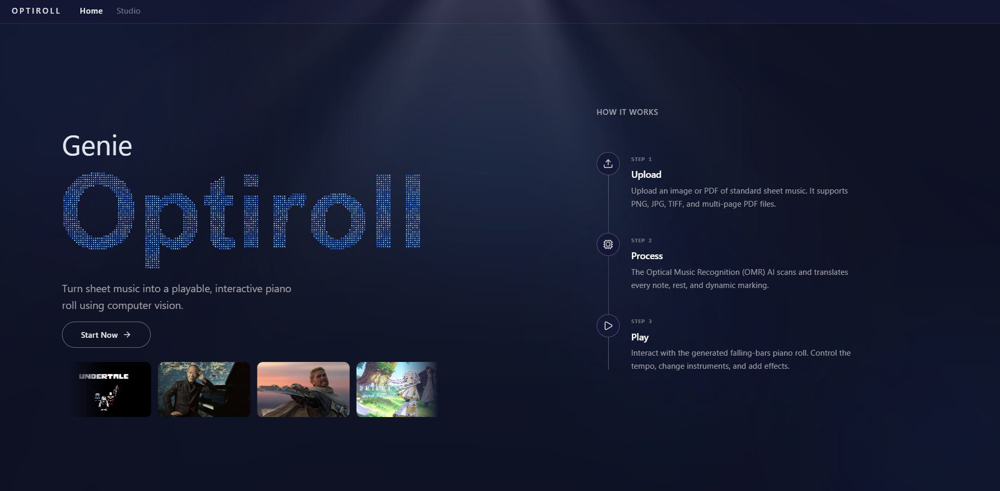
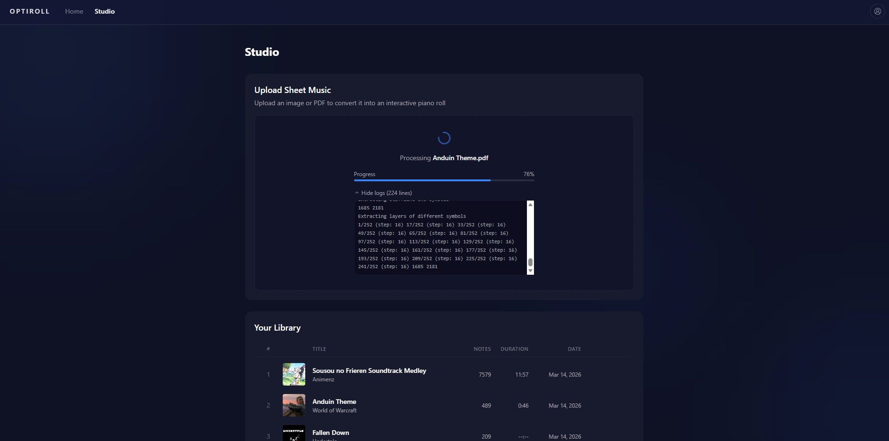
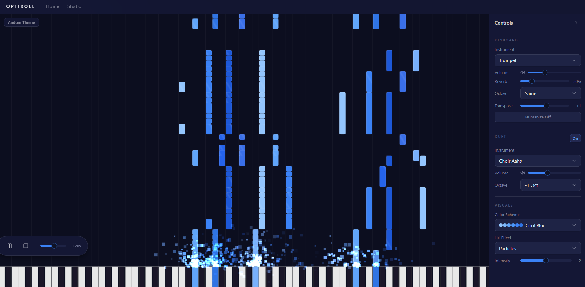
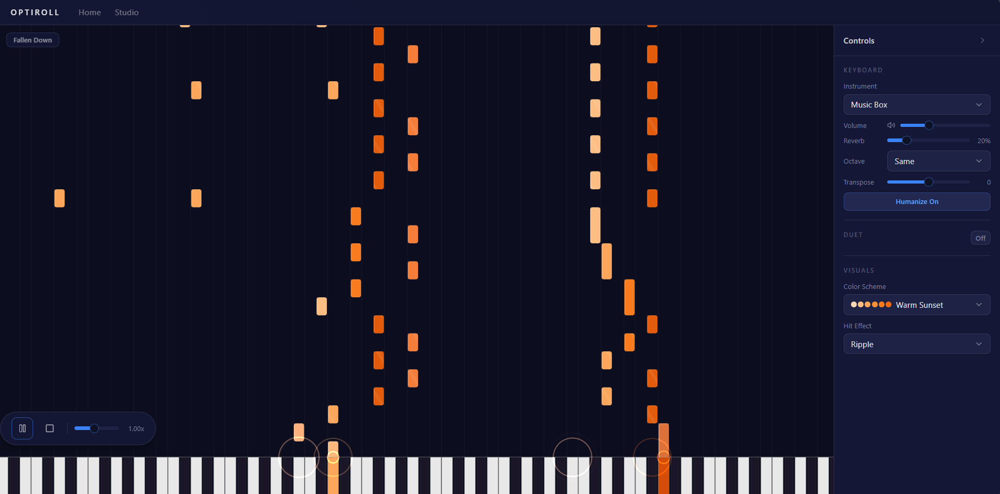

# Genie: Optiroll

A full-stack web application that converts sheet music images into interactive, playable piano rolls using Optical Music Recognition (OMR).

## Preview

|                                                                          |                                                                      |
| ------------------------------------------------------------------------ | -------------------------------------------------------------------- |
|                                            |                                      |
| **Home**, Landing page with particle text, light rays, and song carousel | **Studio**, Upload sheet music and browse your library               |
|                              |                         |
| **Player**, Cool Blues palette with particle hit effects and duet mode   | **Player**, Warm Sunset palette with ripple hit effects and humanize |

## How It Works

1. **Upload** — Drop an image (PNG, JPG, TIFF) or a multi-page PDF of standard sheet music into the upload zone.
2. **Process** — The backend runs [oemer](https://github.com/BreezeWhite/oemer), an OMR engine, to detect staves, notes, rests, and dynamics. It outputs a MusicXML representation that is then parsed by [muspy](https://github.com/salu133445/muspy) into individual MIDI note events (pitch, start time, duration).
3. **Play** — The frontend renders a real-time falling-bars piano roll on an HTML Canvas. Notes are scheduled through the Web Audio API using [smplr](https://github.com/danigb/smplr) sampled instruments (grand piano, electric pianos, mellotron, soundfonts). Users can adjust speed, volume, reverb, octave shift, transposition, add a duet layer, switch color schemes, and toggle hit effects.

## Project Structure

```
Piano Vision/
├── backend/             # Python API server
│   ├── main.py          # FastAPI app — upload, process, SSE progress, CRUD
│   ├── database.py      # SQLite helpers (sheets, notes)
│   └── requirements.txt
├── frontend/            # React SPA
│   ├── src/
│   │   ├── pages/       # HomePage, StudioPage, PlayerPage
│   │   ├── components/  # PianoRoll, ControlBar, SheetUpload, SheetLibrary, LightRays
│   │   ├── hooks/       # usePianoPlayer (audio scheduling, playback state)
│   │   ├── lib/         # API client, color schemes, particle system, types
│   │   └── index.css    # Tailwind v4 theme
│   ├── package.json
│   └── vite.config.ts
└── .gitignore
```

## Tech Stack

### Backend

| Library                                           | Purpose                                           |
| ------------------------------------------------- | ------------------------------------------------- |
| [FastAPI](https://fastapi.tiangolo.com/)          | REST API + Server-Sent Events for upload progress |
| [oemer](https://github.com/BreezeWhite/oemer)     | Optical Music Recognition — image to MusicXML     |
| [muspy](https://github.com/salu133445/muspy)      | MusicXML parsing into note events                 |
| [PyMuPDF (fitz)](https://pymupdf.readthedocs.io/) | PDF page extraction to images                     |
| [OpenCV](https://opencv.org/)                     | Image preprocessing (headless)                    |
| SQLite                                            | Local database for sheets and note data           |

### Frontend

| Library                                           | Purpose                                                                      |
| ------------------------------------------------- | ---------------------------------------------------------------------------- |
| [React 19](https://react.dev/)                    | UI framework                                                                 |
| [Vite 8](https://vite.dev/)                       | Build tool and dev server                                                    |
| [Tailwind CSS v4](https://tailwindcss.com/)       | Utility-first styling (CSS-first config)                                     |
| [TypeScript 5.9](https://www.typescriptlang.org/) | Type safety                                                                  |
| [React Router v7](https://reactrouter.com/)       | Client-side routing                                                          |
| [shadcn/ui](https://ui.shadcn.com/)               | UI primitives (Button, Select, Slider, Card) via Radix                       |
| [smplr](https://github.com/danigb/smplr)          | Web Audio sampled instruments (piano, electric piano, mellotron, soundfonts) |
| [GSAP](https://gsap.com/)                         | Animations (sidebar, page transitions, entrance effects)                     |
| [ogl](https://github.com/oframe/ogl)              | WebGL light rays background effect                                           |
| [Lucide React](https://lucide.dev/)               | Icon set                                                                     |

## Getting Started

### Prerequisites

- Python 3.10+
- Node.js 18+
- npm

### Backend

```bash
cd backend

# Create and activate a virtual environment
python -m venv venv
# Windows
venv\Scripts\activate
# macOS/Linux
source venv/bin/activate

# Install dependencies
pip install -r requirements.txt

# Start the API server (port 8000)
uvicorn main:app --reload
```

The API will be available at `http://localhost:8000`. Uploaded files are stored in `backend/uploads/` and sheet data in `backend/piano_vision.db`.

### Frontend

```bash
cd frontend

# Install dependencies
npm install --legacy-peer-deps

# Start the dev server (port 5173)
npm run dev
```

> `--legacy-peer-deps` is needed because `@tailwindcss/vite` has a peer dependency on vite 5-7 while the project uses vite 8. Everything works correctly.

The frontend proxies API requests to the backend. Open `http://localhost:5173` in your browser.

### Production Build

```bash
cd frontend
npm run build
```

The compiled output goes to `frontend/dist/`. Serve it with any static file server, or configure FastAPI to mount it.

## Features

- **Piano Roll** — Canvas-rendered falling bars with glassmorphism styling, diagonal glare animation, and per-note color mapping
- **Multiple Instruments** — Grand piano, electric pianos, mellotron, and General MIDI soundfonts
- **Duet Mode** — Layer a second instrument at a different octave
- **Transposition** — Shift playback by -12 to +12 semitones
- **Visual Customization** — 6 color palettes, 4 hit effects (glow, particles, ripple, none), adjustable particle intensity
- **Humanize** — Random velocity/timing/detune variation for more natural playback
- **Draggable Transport** — Play/pause/stop and speed controls in a floating, repositionable overlay
- **Sheet Library** — Spotify-style list view with inline editing, image uploads, and click-to-play navigation
- **Responsive Sidebar** — GSAP-animated control panel that slides in from the right
